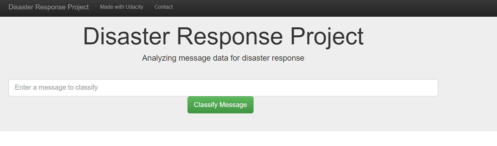
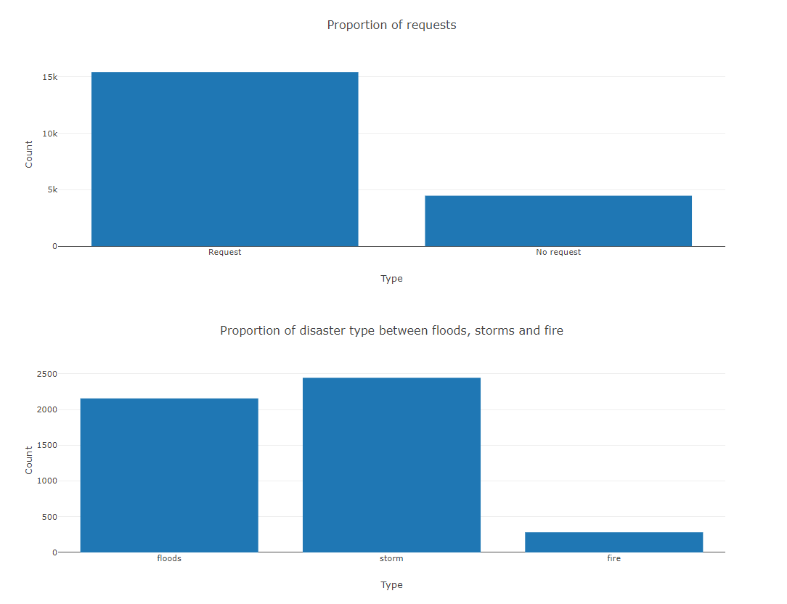

# Disaster Response Pipeline Project

## Motivation
The following project serves to provide a prototype for a quicker and more effective response to natural desasters.
As there are an overwhelming number of tweets in times of such an event, organisations providing help can be overwhelmed with filtering through the tweets manually.
This project provides a template for training and categorizing the data in a more efficient way.

## Installation
For using the project you need to install the following packages:
- pandas
- numpy
- sqlalchemy
- nltk
- pickle
- scikit-learn
- flask 

### Instructions:
1. Run the following commands in the project's root directory to set up your database and model.

    - To run ETL pipeline that cleans data and stores in database
        `python data/process_data.py data/disaster_messages.csv data/disaster_categories.csv data/DisasterResponse.db`
    - To run ML pipeline that trains classifier and saves
        `python models/train_classifier.py data/DisasterResponse.db models/classifier.pkl`

2. Run the following command in the app's directory to run your web app.
    `python run.py`

3. Go to http://0.0.0.0:3001/

## Files
- data/process_data.py: Preprocessing the raw data, combining messages with categories
- models/train_classifier.py: Training, evaluating and exporting a classification pipeline
- app/run.py: Web-app for displaying statistics and on-the-fly classification

## Acknowledgements
- pandas
- numpy
- sqlalchemy
- nltk
- pickle
- scikit-learn
- flask
- Figure Eight (dataset)